# MalariaSense

YOLOv11x-based malaria parasite detection from Giemsa-stained thin blood smear microscopy images, with a Raspberry Pi 5 deployment target.

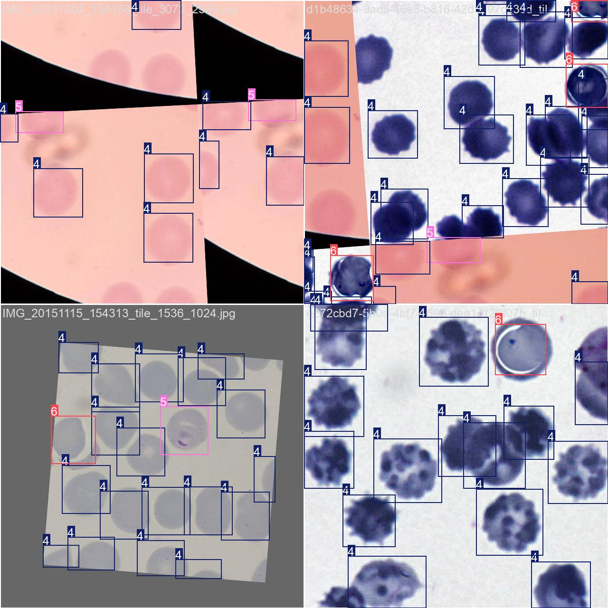

> **Research prototype — not validated for clinical use.** Parasitaemia estimates are approximate and require clinical interpretation.

---

## What It Does

MalariaSense takes a microscopy image of a Giemsa-stained thin blood smear and detects individual cells, classifying them across seven trained classes:

| ID | Class | Role in Output |
|----|-------|----------------|
| 0 | Ring | Counted in parasitaemia (asexual) |
| 1 | Trophozoite | Counted in parasitaemia (asexual) |
| 2 | Schizont | Counted in parasitaemia (asexual) |
| 3 | Gametocyte | Reported separately (sexual form, excluded from parasitaemia per WHO counting guidance) |
| 4 | Uninfected | Counted as denominator |
| 5 | Parasitised | Counted in parasitaemia (asexual, stage ambiguous) |
| 6 | Babesia | Excluded from parasitaemia numerator; retained in detected-RBC denominator; reported separately |

**Parasitaemia** = asexual parasites ÷ total detected RBCs. Babesia-like detections are excluded from the malaria-positive numerator but retained in the detected-RBC denominator and reported separately for review.

Hyperparasitaemia (>10%) is flagged in line with WHO guidance that P. falciparum parasitaemia exceeding 10% indicates severe malaria risk. Clinical severity cannot be determined from image output alone.

## Architecture

| Stage | Method |
|-------|--------|
| **Detection backbone** | YOLOv11x fine-tuned on BBBC041 + NIH-NLM datasets |
| **Tiling** | SAHI-style overlapping tiles (see Inference Configurations below) |
| **Stain invariance** | Reinhard colour transfer + aggressive HSV augmentation during training |
| **Class imbalance** | Inverse-frequency loss weighting (236:1 imbalance ratio) |
| **Babesia differentiation** | Synthetic injection of 1,174 Babesia crops via colour transfer |
| **Inference preprocessing** | Auto-detect stain type → adaptive sharpening, CLAHE, denoising |
| **Post-processing** | Soft-NMS (σ=0.5), multi-scale fusion, per-class confidence thresholds |
| **Edge deployment** | NCNN export for Raspberry Pi 5 + Camera Module 3 (autofocus) |

### Inference Configurations

The desktop and edge deployments use different tiling strategies:

| Configuration | Tile Sizes | Overlap | Use Case |
|---------------|-----------|---------|----------|
| Desktop (accuracy-focused) | 480, 512, 640 px (multi-scale) | 40% | Offline analysis, evaluation |
| Raspberry Pi (latency-focused) | 640 px | 15% | Edge deployment target; benchmarking pending |

The published evaluation metrics below were generated using the desktop configuration. The sample inference image (9172(3).bmp) was processed with the desktop pipeline on an RTX 5070.

## Evaluation Results

Fine-tuned YOLOv11x evaluated on the validation split (15% held out, stratified).

### Per-Class Performance (AP@0.5)

| Class | AP@0.5 | Confusion Matrix Accuracy |
|-------|--------|--------------------------|
| Ring | 0.883 | 73% |
| Trophozoite | 0.764 | 79% |
| Schizont | 0.882 | 73% |
| Gametocyte | 0.667 | 57% |
| Uninfected | 0.954 | 96% |
| Parasitised | 0.877 | 86% |
| Babesia | 0.995 | 100% |
| **All classes** | **0.860 mAP@0.5** | — |

Overall: **mAP@0.5 = 0.860 · mAP@0.5:0.95 = 0.715 · Precision = 0.82 · Recall = 0.82**

**Metrics excluding synthetic Babesia mimic class:**

The Babesia class was trained on synthetically injected crops (not real co-infected slides), and its high AP (0.995) contributes to the headline mAP. Excluding Babesia, the six-class malaria-only mAP@0.5 is approximately 0.838. The Babesia experiment should be considered exploratory.

### Evaluation Protocol

The train/validation split was performed by the Ultralytics YOLOv11 framework on the tiled dataset. The validation set comprises 15% of tiled images, stratified by class. **Note:** it has not been independently verified whether tiles derived from the same original source smear image are guaranteed to appear exclusively in one split. If overlapping tiles from the same source image appear in both splits, the reported metrics may be optimistically biased. A source-image-disjoint resplit and re-evaluation is planned.

### Precision-Recall Curve

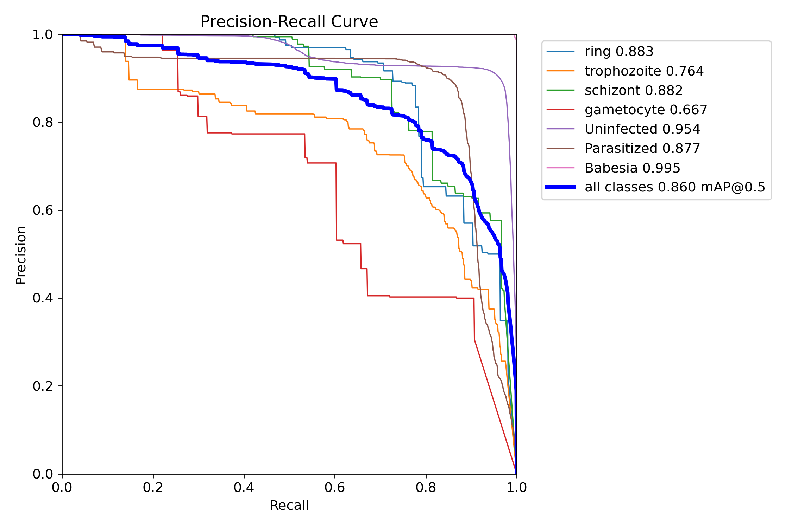

### Confusion Matrix

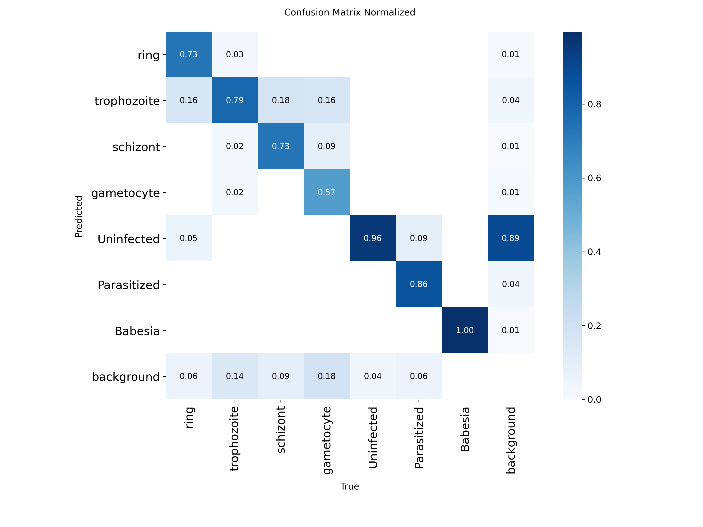

### F1-Confidence Curve

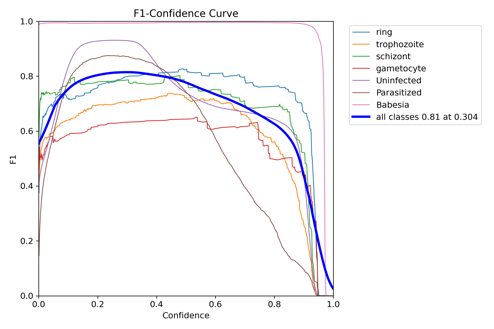

### Validation Predictions vs Ground Truth

Ground-truth labels (left) and model predictions (right) on validation tiles:

| Ground Truth | Model Predictions |
|:---:|:---:|
| 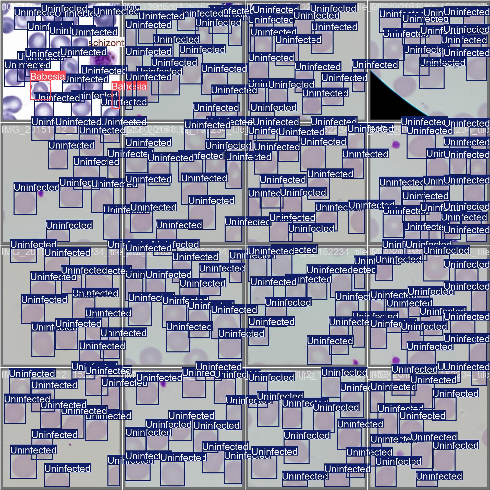 | 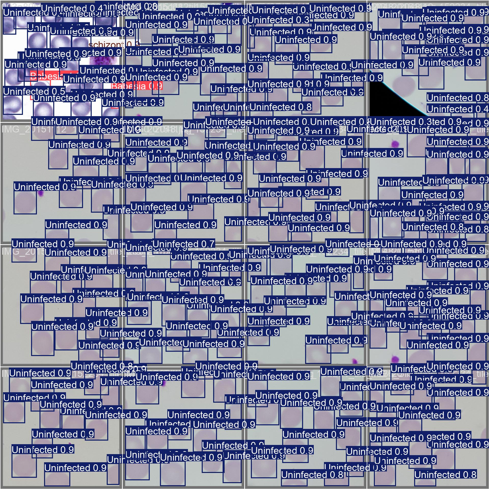 |
| 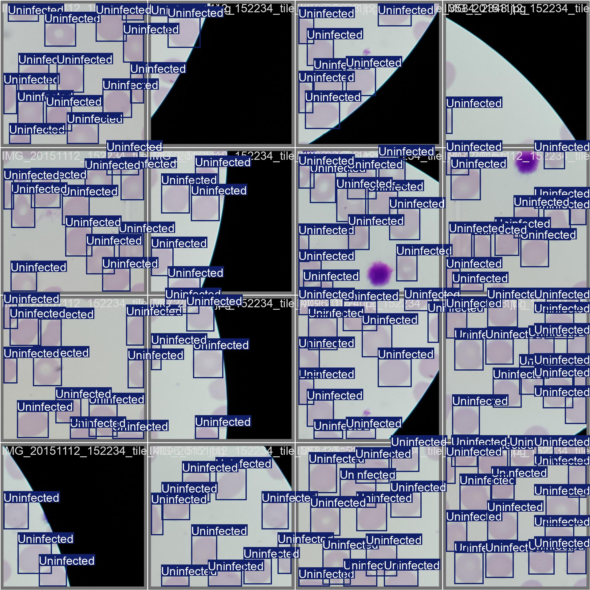 | 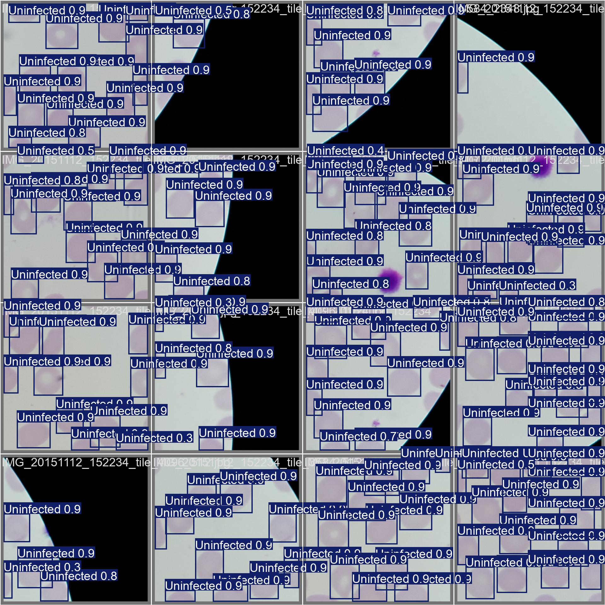 |

## Training Details

- **Model:** YOLOv11x (pretrained on COCO → fine-tuned)
- **Dataset:** 1,208 images → SAHI-tiled → ~340K tile-annotation pairs
- **Imbalance ratio:** 236:1 (Uninfected : Gametocyte)
- **Hardware:** NVIDIA RTX 5070 (8 GB VRAM)
- **Training:** 49 epochs base + 26 epochs fine-tune (AdamW, lr=5e-5, cosine decay)
- **Batch size:** 4 at 640×640 (AMP enabled for base training)
- **Augmentation:** HSV jitter, flip, scale, mosaic (disabled in fine-tune)

Training batch visualisations showing tiled inputs with ground-truth annotations across different stain types:

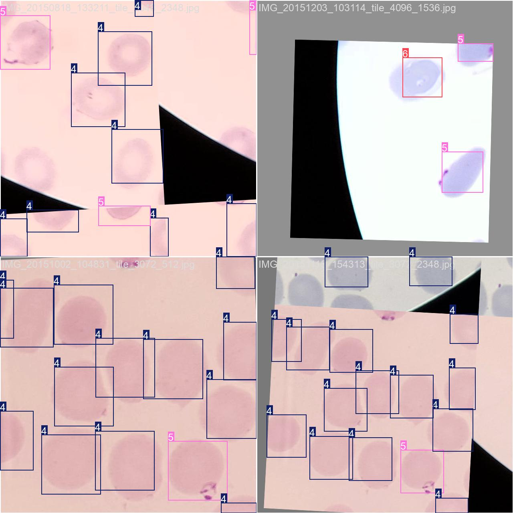

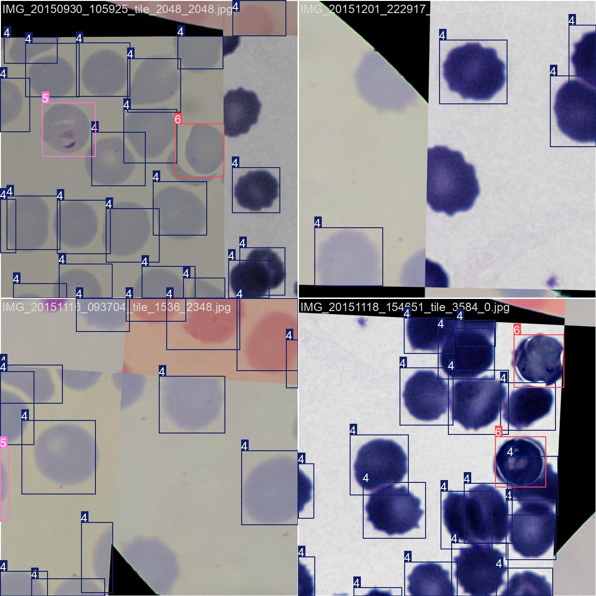

### Class Distribution

After tiling and synthetic Babesia injection:

| Class | Training Annotations | Weight |
|-------|---------------------|--------|
| Uninfected | 300,044 | 0.50 |
| Babesia | 18,522 | 3.24 |
| Parasitised | 13,020 | 3.86 |
| Trophozoite | 3,467 | 7.48 |
| Ring | 1,935 | 10.00 |
| Schizont | 1,372 | 10.00 |
| Gametocyte | 1,272 | 10.00 |

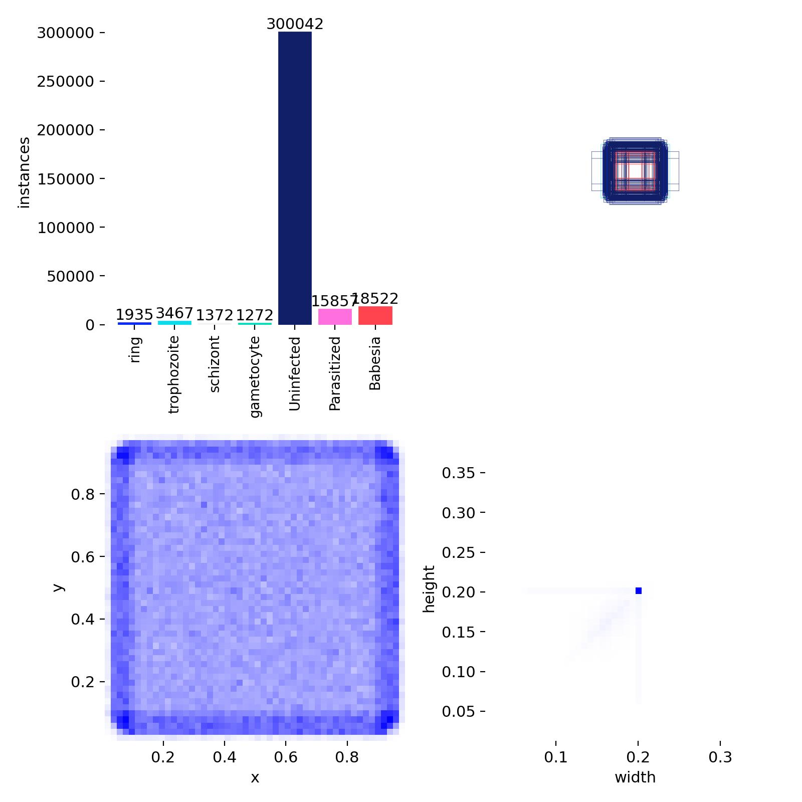

## Sample Inference

Processed on RTX 5070 using the desktop multi-scale configuration.

| Image | Stain | Detections | Parasites | RBCs | Est. Parasitaemia | Time |
|-------|-------|-----------|-----------|------|-------------------|------|
| 9172(3).bmp | Blue | 13 | 4 | 13 | 30.8% | 1.91 s |

> **Note:** Raspberry Pi inference benchmarks have not yet been measured. The 1.91 s figure is from RTX 5070 GPU inference, not edge hardware.

_pred.jpg)

_pred.jpg)

## Repository Structure

```
.
├── app/
│   ├── desktop_app.py             # Desktop GUI (CustomTkinter)
│   └── raspi_app.py               # Raspberry Pi 5 touchscreen app
├── docs/
│   ├── training_samples/          # Training batch visualisations
│   ├── class_distribution.jpg     # Dataset statistics
│   └── class_weights.json         # Computed class weights
├── results/
│   ├── evaluation/                # PR curves, F1 curves, confusion matrices
│   ├── validation_predictions/    # GT vs predicted on val split
│   ├── sample_detections/         # JSON/CSV inference outputs
│   └── sample_visualizations/     # Annotated detection images
├── requirements.txt
└── LICENSE
```

> The data pipeline, training scripts, and model weights are maintained in a private repository. This public repo contains the application layer and full evaluation evidence.

## Setup

### Desktop

```bash
pip install -r requirements-desktop.txt
python app/desktop_app.py
```

### Raspberry Pi 5

Hardware: Camera Module 3 (autofocus), optional 7″ touchscreen.

```bash
# picamera2 is typically installed via Raspberry Pi OS packages
pip install -r requirements-rpi.txt
python app/raspi_app.py
```

The model must be exported to NCNN format for on-device inference.

## Limitations

- **Gametocyte detection is weakest** (AP 0.667, 57% confusion matrix accuracy) — only 1,272 training annotations.
- **Parasitaemia is approximate** — calculated from detection counts, not clinical-grade manual counting.
- **Babesia class is synthetically trained** — not validated on real co-infected slides.
- **No Raspberry Pi benchmarks yet.** Edge inference latency and RAM usage have not been measured.
- **Not validated for clinical use.** This is a research screening prototype.

## Datasets

- [BBBC041](https://bbbc.broadinstitute.org/BBBC041) — Broad Bioimage Benchmark Collection (CC-BY-NC-SA)
- [NIH-NLM Thin Blood Smears](https://lhncbc.nlm.nih.gov/LHC-downloads/downloads.html#malaria-datasets) — National Library of Medicine

## License

MIT
